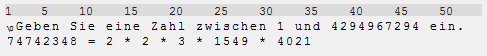

Primfaktorzerlegung
-------------------
Assembler-Projekt für das Modul BTE5053b: Algorithmus zur Primfaktor-Zerlegung auf dem [Carme-Kit](http://carme.bfh.ch). Die Eingabe erfolgt via Computer über die RS-232-Schnittstelle.

